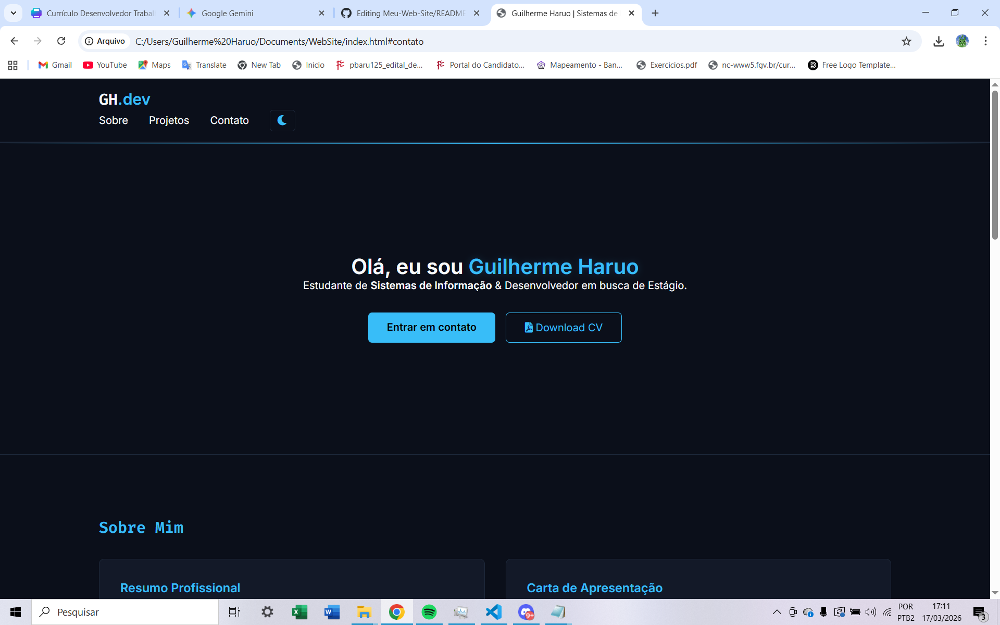

# 🚀 Portfolio Pessoal - Guilherme Haruo

Este é o repositório do meu portfólio web profissional. O projeto foi desenvolvido para centralizar meus projetos acadêmicos, experiências de extensão no **IFSP** e certificações técnicas, servindo como uma vitrine para oportunidades de estágio em **Desenvolvimento de Sistemas**.



---

## 🛠️ Tecnologias Utilizadas

O site foi construído focado em performance e sem dependências pesadas, utilizando:

- **HTML5:** Estrutura semântica e acessível.
- **CSS3:** Estilização moderna com CSS Variables (Dark Mode) e Grid/Flexbox para responsividade.
- **JavaScript (Vanilla):** Lógica personalizada para o modal de certificados e navegação suave, sem o uso de bibliotecas externas para garantir leveza.
- **FontAwesome:** Ícones para redes sociais e contato.

---

## 🌟 Funcionalidades Principais

- **Seção Sobre Mim:** Resumo profissional e carta de apresentação focada em estágio.
- **Galeria de Projetos:** Exibição de trabalhos desenvolvidos (Python, Java MVC, C++ OpenGL).
- **Sistema de Certificados:** Galeria interativa com efeito de zoom personalizado e fechamento via tecla `ESC`.
- **Download de CV:** Botão funcional para baixar o currículo em PDF diretamente.
- **Design Responsivo:** Adaptado para dispositivos móveis, tablets e desktops.

---

## 📂 Estrutura do Projeto

```text
/
├── index.html          # Estrutura principal do site
├── style.css           # Estilização e variáveis de cores
├── script.js           # Lógica do modal e interações
├── /assets             # Pasta para imagens e ícones
└── Currículo.pdf       # Arquivo de currículo atualizado
